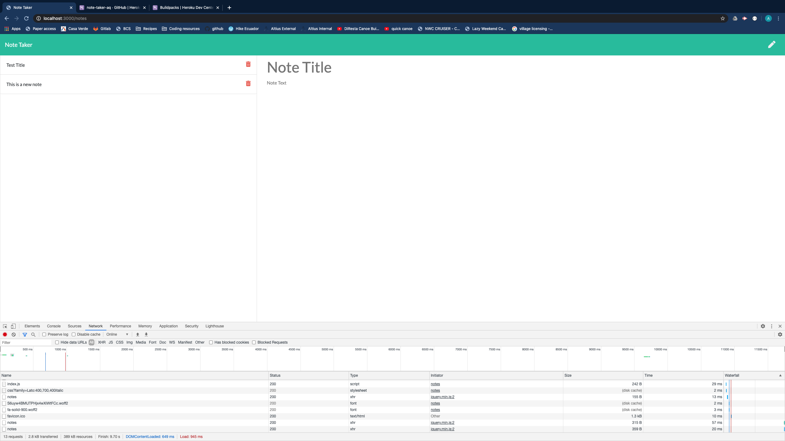

# Unit 11 Express Homework: Note Taker

## User story:


```
AS A rational human being
I WANT to be able to take notes
SO THAT I have the ability to write down material that will help me remember
```

## Description:

This project was aimed at designing an application that could be used to write, save, and delete notes. In this project I developed (with inclass help) an express backend that retrieves notes from a JSON file.  We employed the fs module to access the files and then generated API routes to GET, POST, and DELETE notes. the application was then deployed to heroku.

## Screenshots:

Note taker Page:


